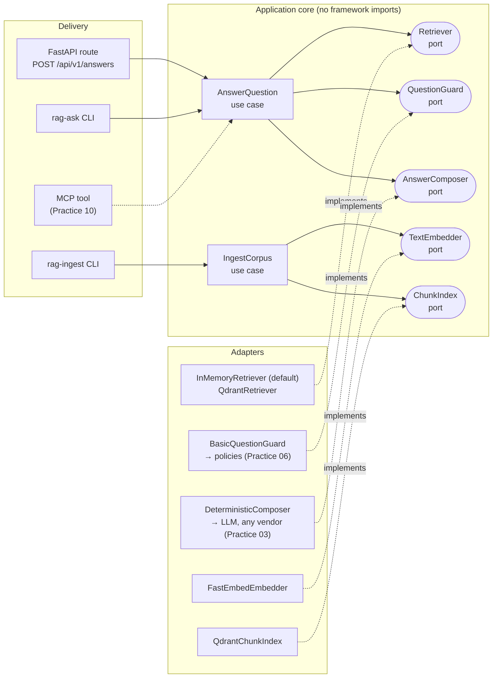

# AI Builder Lab

[](https://github.com/czwie01/ai-builder-lab/actions/workflows/ci.yml)
[](https://www.python.org/)
[](LICENSE)

A hands-on lab for practicing **modern AI engineering**, one production-shaped practice at a
time. The lab grows a single RAG API from a clean architectural seam (this practice) into a
fully featured system — vector search, LLM generation, evals, guardrails, agent orchestration,
observability, UI, and MCP — **without ever changing the HTTP contract**.

Every practice is timeboxed, documented in [`docs/practices/`](docs/practices/), and lands as a
reviewable set of [Conventional Commits](https://www.conventionalcommits.org/).

## Why hexagonal architecture for AI systems?

AI infrastructure churns fast: today's vector database, LLM vendor, and agent framework are
rarely next year's. Ports & adapters (hexagonal architecture) turns that churn into a
non-event. The application core depends on **ports** (Python `Protocol`s); infrastructure
plugs in as **adapters**. Swapping Qdrant for the in-memory retriever, or an LLM for the
deterministic composer, touches one wiring module — never the routes, the use case, or the
tests that define behavior.



The same inversion applies to the dev tooling: agent instructions live in the cross-tool
standard [`AGENTS.md`](AGENTS.md) (the "port"); `CLAUDE.md` and `.claude/commands/` are thin
adapters for one specific coding agent.

## Quickstart

```bash
uv sync                                       # installs Python 3.13 + deps
uv run pytest                                 # unit + API + adapter tests (offline, no infra)
uv run pytest -m eval                         # retrieval-quality evals (recall@3, MRR)
uv run rag-ask "What is a port in hexagonal architecture?"   # use case without HTTP
uv run uvicorn rag_api.main:app --reload      # serve the API (in-memory retriever)
```

The default needs no service, no model download and no network. To run the real pipeline:

```bash
docker compose up -d                          # Qdrant on :6333
uv run rag-ingest --source evals/corpus --recreate         # chunk, embed, index
uv run pytest -m integration                  # congruence tests against the server
export RAG_API_RETRIEVER=qdrant               # now the API and CLI use vector search
uv run rag-ask "How can I swap a database client without rewriting business logic?"
```

```bash
curl -s -X POST localhost:8000/api/v1/answers \
  -H 'Content-Type: application/json' \
  -d '{"question": "What is a port in hexagonal architecture?", "top_k": 3}'
```

```json
{
  "answer": "In hexagonal architecture, a port is an interface the application core depends on... (Based on 3 source(s): ...)",
  "citations": [{"document_id": "architecture-01", "score": 0.8571}, ...]
}
```

Errors follow [RFC 9457](https://www.rfc-editor.org/rfc/rfc9457) problem details, and every
response carries an `X-Request-ID` for correlation.

## Roadmap

**Product track** — every practice plugs into a seam created in Practice 01; every
retrieval- or generation-affecting change is gated by the eval suite. (Decisions and sources:
[ADR-003](docs/adr/ADR-003-roadmap-v2.md).)

| # | Practice | Mission area | Key tech | Status |
|---|----------|--------------|----------|--------|
| 01 | [Clean RAG API boundary](docs/practices/practice-01-rag-api-boundary.md) | Software architecture | FastAPI, DI, ports & adapters | ✅ done |
| 02 | [Vector retrieval with Qdrant](docs/practices/practice-02-qdrant-retrieval.md) | Infrastructure | Qdrant, docker-compose, fastembed (offline/CPU), `TextEmbedder` port, structure-aware chunking, payload indexes | ✅ done |
| 03 | LLM answer generation | AI engineering | Provider-agnostic `AnswerComposer` adapters (Anthropic tool-use, OpenAI strict JSON schema), validation-retry, prompt caching, fallback decorator | ⬜ planned |
| 04 | Evals as a CI gate | Evals | RAG triad (faithfulness via claim decomposition, answer relevance), `JudgeModel` port, VCR-recorded judge calls for offline CI, golden-set growth | ⬜ planned |
| 05 | Advanced retrieval | AI engineering | Hybrid search (BM25/miniCOIL + RRF), metadata filtering, `Reranker` port (local + hosted), contextual retrieval, quantization/MRL — each step an eval delta | ⬜ planned |
| 06 | Guardrails | Guardrails | OWASP GenAI LLM Top 10 2026 threat model, `AnswerGuard`/`ContextGuard` ports, Presidio PII, chunk-level injection scanning, groundedness gate, promptfoo red-team in CI | ⬜ planned |
| 07 | Agent orchestration | Agents | Agentic RAG (routing → retrieval-as-tool → judge-gated re-retrieval); Pydantic AI behind a port; ADR vs LangGraph / vendor SDKs | ⬜ planned |
| 08 | Observability | Observability | OpenTelemetry gen_ai.* semconv, RAG-shaped spans, token/cost metrics, Arize Phoenix backend, eval–trace linkage | ⬜ planned |
| 09 | Chat frontend | UI/UX | React + Vite + TS SPA, @hey-api/openapi-ts + Zod 4 codegen, POST + fetch-SSE streaming, assistant-ui; ADR: SPA vs monolith | ⬜ planned |
| 10 | MCP server | Agent interop | FastMCP, Streamable HTTP (2026-07-28 spec), structured tool outputs, OAuth 2.1, MCP threat model — third delivery mechanism | ⬜ planned |
| 11 | LLM Wiki knowledge base | Knowledge mgmt | Agent-curated markdown wiki (raw/ + wiki/ + lint), hybrid retrieval over it, graph retrieval only if a multi-hop eval slice proves it, file-based memory port | ⬜ planned |

**Engineering track** — the tooling ("harness engineering") layer, evolving in parallel; see
[docs/workflow/agent-tooling.md](docs/workflow/agent-tooling.md):

| # | Step | Status |
|---|------|--------|
| E1 | AGENTS.md canonical + CLAUDE.md symlink + thin command adapters | ✅ done |
| E2 | Practice workflows as portable Agent Skills (`.claude/skills/`, `.agents/skills` symlink, OpenCode mirrors) | ✅ done |
| E3 | Per-skill evals in CI; plugin packaging once ≥2 reusable skills exist | ⬜ planned |

## Repo map

```
src/rag_api/
├── domain/        # frozen dataclasses — no framework, no Pydantic
├── ports/         # Protocols the core depends on
├── application/   # use cases orchestrating through ports
├── adapters/      # concrete implementations (infrastructure lives here)
├── api/           # FastAPI: schemas, DI wiring, RFC 9457 errors, middleware, lifespan
├── cli.py         # same use case, no HTTP
└── ingest_cli.py  # rag-ingest: chunk, embed and index a corpus
tests/             # unit + adapter (Qdrant local mode) + API — fully offline
tests/integration/ # needs a real Qdrant: `pytest -m integration`
evals/corpus/      # frozen markdown corpus the gate measures
evals/             # golden set + retrieval metrics, gated by `pytest -m eval`
compose.yaml       # local Qdrant
docs/              # ADRs, practice logs, tool-agnostic workflows
```

Key docs: [ADR-001 Hexagonal architecture](docs/adr/ADR-001-hexagonal-architecture.md) ·
[ADR-002 Tech stack](docs/adr/ADR-002-tech-stack.md) ·
[ADR-004 Vector retrieval](docs/adr/ADR-004-vector-retrieval.md) ·
[Practice workflow](docs/workflow/practice-scaffold.md) ·
[Recommended agent skills](docs/workflow/recommended-skills.md)

## License

[MIT](LICENSE)
