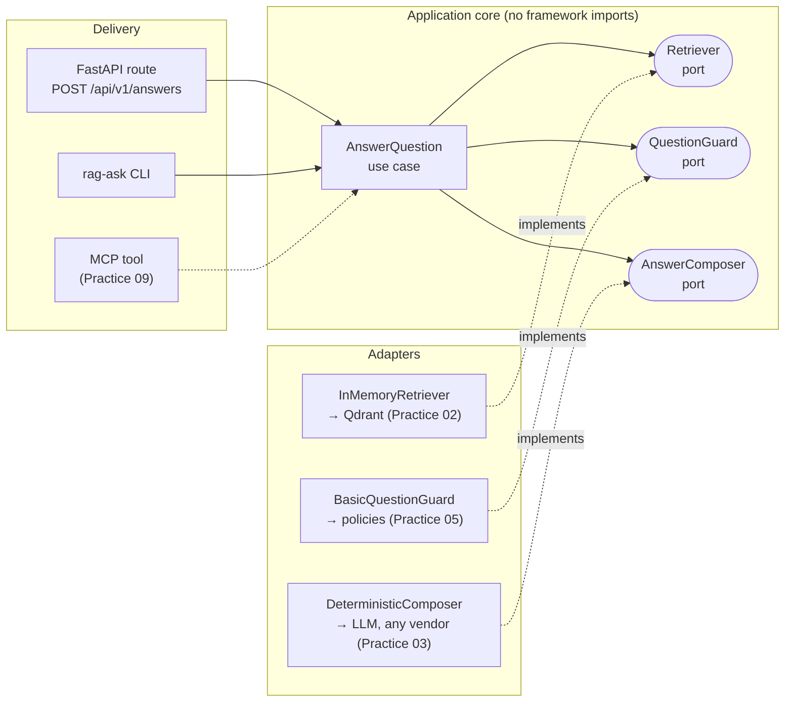

# AI Builder Lab

[](https://github.com/czwie01/ai-builder-lab/actions/workflows/ci.yml)
[](https://www.python.org/)
[](LICENSE)

A hands-on lab for practicing **modern AI engineering**, one production-shaped practice at a
time. The lab grows a single RAG API from a clean architectural seam (this practice) into a
fully featured system — vector search, LLM generation, evals, guardrails, agent orchestration,
observability, UI, and MCP — **without ever changing the HTTP contract**.

Every practice is timeboxed, documented in [`docs/practices/`](docs/practices/), and lands as a
reviewable set of [Conventional Commits](https://www.conventionalcommits.org/).

## Why hexagonal architecture for AI systems?

AI infrastructure churns fast: today's vector database, LLM vendor, and agent framework are
rarely next year's. Ports & adapters (hexagonal architecture) turns that churn into a
non-event. The application core depends on **ports** (Python `Protocol`s); infrastructure
plugs in as **adapters**. Swapping Qdrant for the in-memory retriever, or an LLM for the
deterministic composer, touches one wiring module — never the routes, the use case, or the
tests that define behavior.



The same inversion applies to the dev tooling: agent instructions live in the cross-tool
standard [`AGENTS.md`](AGENTS.md) (the "port"); `CLAUDE.md` and `.claude/commands/` are thin
adapters for one specific coding agent.

## Quickstart

```bash
uv sync                                       # installs Python 3.13 + deps
uv run pytest                                 # unit + API tests (offline, no infra)
uv run pytest -m eval                         # retrieval-quality evals (recall@3, MRR)
uv run rag-ask "What is a port in hexagonal architecture?"   # use case without HTTP
uv run uvicorn rag_api.main:app --reload      # serve the API
```

```bash
curl -s -X POST localhost:8000/api/v1/answers \
  -H 'Content-Type: application/json' \
  -d '{"question": "What is a port in hexagonal architecture?", "top_k": 3}'
```

```json
{
  "answer": "In hexagonal architecture, a port is an interface the application core depends on... (Based on 3 source(s): ...)",
  "citations": [{"document_id": "architecture-01", "score": 0.8571}, ...]
}
```

Errors follow [RFC 9457](https://www.rfc-editor.org/rfc/rfc9457) problem details, and every
response carries an `X-Request-ID` for correlation.

## Roadmap

| # | Practice | Mission area | Key tech | Status |
|---|----------|--------------|----------|--------|
| 01 | [Clean RAG API boundary](docs/practices/practice-01-rag-api-boundary.md) | Software architecture | FastAPI, DI, ports & adapters | ✅ done |
| 02 | Real vector retrieval | Infrastructure | Qdrant, docker-compose, fastembed | ⬜ planned |
| 03 | LLM answer generation | AI engineering | Provider-agnostic `AnswerComposer` adapters (Anthropic, OpenAI), prompt files | ⬜ planned |
| 04 | Evals as a CI gate | Evals | RAG triad; framework ADR (DeepEval / Inspect / promptfoo vs pytest-native) | ⬜ planned |
| 05 | Guardrails | Guardrails | Input/output policies, injection defense, red-team suite, `AnswerGuard` port | ⬜ planned |
| 06 | Agent orchestration | Agents | Retrieve→grade→rewrite→compose graph; ADR: LangGraph vs Pydantic AI | ⬜ planned |
| 07 | Observability | Observability | OpenTelemetry tracing, Jaeger | ⬜ planned |
| 08 | Chat UI | UI/UX | SSE streaming frontend, built with the open-source Impeccable design skill | ⬜ planned |
| 09 | MCP server | Agent interop | Same use case exposed as an MCP tool — third delivery mechanism | ⬜ planned |

Each practice plugs into a seam created in Practice 01. That is the point.

## Repo map

```
src/rag_api/
├── domain/        # frozen dataclasses — no framework, no Pydantic
├── ports/         # Protocols the core depends on
├── application/   # use cases orchestrating through ports
├── adapters/      # concrete implementations (infrastructure lives here)
├── api/           # FastAPI: schemas, DI wiring, RFC 9457 errors, middleware
└── cli.py         # same use case, no HTTP
tests/             # unit (fakes) + API (TestClient) — fully offline
evals/             # golden set + retrieval metrics, gated by `pytest -m eval`
docs/              # ADRs, practice logs, tool-agnostic workflows
```

Key docs: [ADR-001 Hexagonal architecture](docs/adr/ADR-001-hexagonal-architecture.md) ·
[ADR-002 Tech stack](docs/adr/ADR-002-tech-stack.md) ·
[Practice workflow](docs/workflow/practice-scaffold.md) ·
[Recommended agent skills](docs/workflow/recommended-skills.md)

## License

[MIT](LICENSE)
